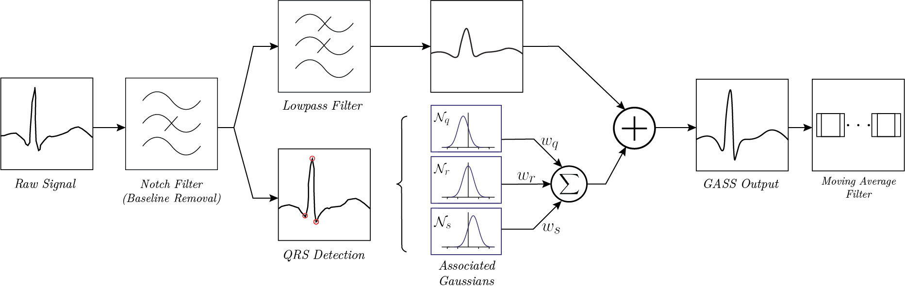

# ECG Arrhythmia Detection using Gaussian Assisted Signal Smoothing (GASS)



## 🩺 Overview

This repository contains the source code, models, and preprocessing tools for our research project titled:  
**"Detection of Arrhythmia from Electrocardiogram Signals using a Novel Gaussian Assisted Signal Smoothing and Pattern Recognition"**  
Published in *Biomedical Signal Processing and Control (Elsevier), Volume 73 (2022), 103469*.

The system utilizes a novel **Gaussian Assisted Signal Smoothing (GASS)** technique to denoise ECG signals while preserving peak characteristics, enabling high-performance arrhythmia detection using a lightweight deep learning pipeline.

---

## 🧠 Abstract

We propose a signal processing and classification framework for automated arrhythmia detection from ECG signals. Raw ECG signals are first denoised using **Gaussian Assisted Signal Smoothing (GASS)**, which models ECG peaks as weighted Gaussian functions on top of a low-pass filtered baseline. Extracted heartbeats are converted into 128×128 images and passed through a lightweight **CNN + SVM** cascade for classification across 11 arrhythmia classes. Our approach achieves:

- **97.63% overall accuracy**
- **0.9263 average F1-score**
- Low computational footprint: **131,661 CNN parameters**
- Evaluation on the **MIT-BIH Arrhythmia Dataset**

---

## 📁 Repository Structure

```bash
.
├── cnn/           # CNN-based classification model (PyTorch)
├── gass/          # Signal smoothing routines (MATLAB & Python)
├── qrs detection/ # Pan-Tompkins algorithm implementation
├── svm/           # Quadratic SVM for subclass classification
├── utility/       # Support scripts for signal filtering and plotting
├── images/        # Visual examples and schematic figures
└── README.md
