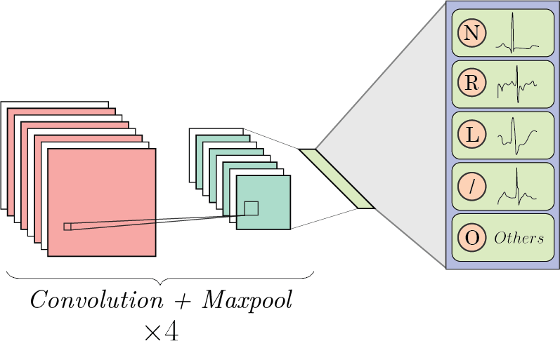

# Convolutional Neural Network

The model architecure is as follows :

This folder contains the following files :
* `ecgSignalsResize` : Resizes all signals to a fixed length
* `ecgSignalstoImage` : Converts the signals to images from their Time Series plots

* `Templates Correlation` : Uses Pearson's correlation coefficient to select a set of templates from a given class

* `Model Training` : Contains the code to train the CNN model using PyTorch
