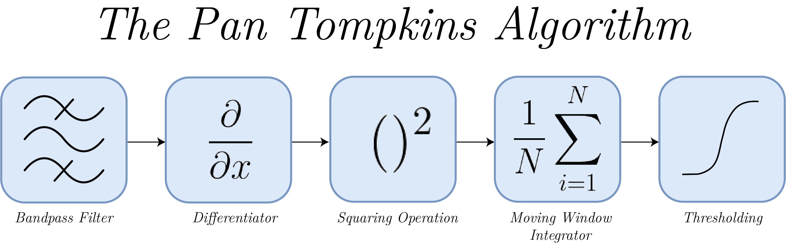

# QRS Peak Detection

This folder contains the implementation of the Pan-Tompkins algorithm for QRS peak detection. A sample signal `ECG1.mat` has been provided for testing.
To run the code on MATLAB, use :
  `pan_tompkin(signal, sampling_frequency, flag)`
  The flag is set to 1 to display the plots.

