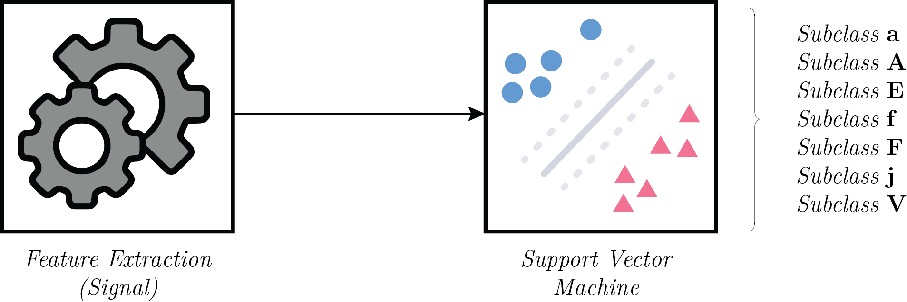

# Quadratic Support Vector Machine

The quadratic SVM is used to classify the signal from the class *Others* into its corresponding sub-class. This folder consists of the following files :
* `svm.mlx` : A MATLAB livescript to demonstrate the working of the support vector machine for signals from class *Others*
* `Trained_Model.mat` : Contains the trained SVM model
* `\Others` : Contains sample signals for classes **A**, **a**, **F**, **j**, **f**, **E** and **V**.
